# General Software Toolbox for Linux

<!-- TOC -->

- [General Software Toolbox for Linux](#general-software-toolbox-for-linux)
    - [Gromacs](#gromacs)
            - [Compile Gromacs with X-Window gmx view, GPU CUDA support](#compile-gromacs-with-x-window-gmx-view-gpu-cuda-support)
        - [Change gromacs version in a fish shell](#change-gromacs-version-in-a-fish-shell)
        - [Use a handmade script ~/.local/bin/source_gmx to source files in different location in a fish shell](#use-a-handmade-script-localbinsource_gmx-to-source-files-in-different-location-in-a-fish-shell)
    - [VMD](#vmd)
        - [Create a .destop file on Linux to open VMD using explorer](#create-a-destop-file-on-linux-to-open-vmd-using-explorer)
    - [Python Development](#python-development)
        - [Tests](#tests)
    - [Conda](#conda)
        - [Look for a package in a given environment](#look-for-a-package-in-a-given-environment)
        - [Look for a package in all conda environments](#look-for-a-package-in-all-conda-environments)
        - [Install an environment out of the default folder](#install-an-environment-out-of-the-default-folder)
        - [Python script that create backups of conda environment](#python-script-that-create-backups-of-conda-environment)
        - [Set environment variables in conda env](#set-environment-variables-in-conda-env)
        - [Source a file when activating a conda environment](#source-a-file-when-activating-a-conda-environment)
    - [Pip](#pip)
        - [Install/Uninstall a package from source using setup.py and distutils](#installuninstall-a-package-from-source-using-setuppy-and-distutils)
    - [Git](#git)
        - [Version a git repo](#version-a-git-repo)
        - [Untrack files](#untrack-files)
        - [Logging activity](#logging-activity)
        - [Add remote repo](#add-remote-repo)
        - [Merging a branch on another](#merging-a-branch-on-another)
        - [Add one commit from another branch](#add-one-commit-from-another-branch)
        - [Keep local changes not committed in memory](#keep-local-changes-not-committed-in-memory)
    - [Keepass](#keepass)
        - [Download linux client](#download-linux-client)
        - [Get passwords saved in a web browser](#get-passwords-saved-in-a-web-browser)
        - [Use auto-type to fill automatically fields when signing in from a web page](#use-auto-type-to-fill-automatically-fields-when-signing-in-from-a-web-page)
        - [Add urls in web page titles](#add-urls-in-web-page-titles)
        - [Auto-typing format](#auto-typing-format)
    - [KeepassXC other method](#keepassxc-other-method)
        - [Install](#install)
        - [Autofill](#autofill)
    - [Keepass on Android](#keepass-on-android)
    - [Searching to an entry in a web browser on Android](#searching-to-an-entry-in-a-web-browser-on-android)
    - [Gdrive](#gdrive)
    - [NextCloud](#nextcloud)
        - [Install Nextcloud using apt and PPA sources](#install-nextcloud-using-apt-and-ppa-sources)
        - [Uninstall all nextcloud packages and dependencies](#uninstall-all-nextcloud-packages-and-dependencies)
        - [Using snap](#using-snap)
    - [Latex](#latex)
        - [Latex distribution](#latex-distribution)
        - [Forward/backward previex](#forwardbackward-previex)
        - [On VSCode](#on-vscode)
    - [Github](#github)
        - [Save a token password key](#save-a-token-password-key)
        - [Deposit of a source code on HAL](#deposit-of-a-source-code-on-hal)
    - [Zotero](#zotero)
        - [Commands](#commands)
            - [Open the preview in Vscode](#open-the-preview-in-vscode)
        - [Open Zotero with default GTK environment](#open-zotero-with-default-gtk-environment)
        - [Backup/Restore Zotero](#backuprestore-zotero)
        - [Repair sqlite](#repair-sqlite)
        - [Syncronize Zotero on a remote folder](#syncronize-zotero-on-a-remote-folder)
    - [Google Drive on linux architecture](#google-drive-on-linux-architecture)
        - [Via Google-drive-ocamlfuse](#via-google-drive-ocamlfuse)
    - [VSCode](#vscode)
        - [Useful extensions](#useful-extensions)
        - [Shortcuts](#shortcuts)
            - [Overview of principal keyboard shortcuts :](#overview-of-principal-keyboard-shortcuts-)
        - [Markdown](#markdown)
            - [Preview markdown on the right side](#preview-markdown-on-the-right-side)
            - [Extensions :](#extensions-)
            - [Link references in a markdown file](#link-references-in-a-markdown-file)
            - [Image centered with caption :](#image-centered-with-caption-)
    - [Tcl-VMD toolbox](#tcl-vmd-toolbox)
            - [Render in png format with tachyon](#render-in-png-format-with-tachyon)
            - [Render with tachyon and transparency and smaller size](#render-with-tachyon-and-transparency-and-smaller-size)
        - [Turorials](#turorials)
            - [Render a snapshot](#render-a-snapshot)
        - [Crop an image](#crop-an-image)
            - [Operations on list](#operations-on-list)
            - [Wrap a selection](#wrap-a-selection)
            - [draw a dashed line between two atoms and a measure distance](#draw-a-dashed-line-between-two-atoms-and-a-measure-distance)
    - [Inkscape](#inkscape)
    - [Network](#network)
        - [Get IP adress from domain name](#get-ip-adress-from-domain-name)
        - [VPN](#vpn)
            - [Method using nmcli commands](#method-using-nmcli-commands)
            - [Use VPN on Debian 10 machine sirius](#use-vpn-on-debian-10-machine-sirius)
            - [GUI OpenVPN](#gui-openvpn)
            - [Install old version of OpenVPN in Ubuntu 22.04 in order to use old .ovpn files](#install-old-version-of-openvpn-in-ubuntu-2204-in-order-to-use-old-ovpn-files)
    - [Jupyter](#jupyter)
        - [S’identifier en tant qu’administrateur](#sidentifier-en-tant-quadministrateur)
        - [Convert a notebook into a python script](#convert-a-notebook-into-a-python-script)
        - [Change conda environment](#change-conda-environment)
        - [Work remotely](#work-remotely)
            - [Open a jupyter notebook from a remote server:](#open-a-jupyter-notebook-from-a-remote-server)
            - [List jupyter notebooks servers open :](#list-jupyter-notebooks-servers-open-)
            - [Delete a jupyter server :](#delete-a-jupyter-server-)
            - [Delete all jupyter servers and possible crashed servers :](#delete-all-jupyter-servers-and-possible-crashed-servers-)
    - [Movie converter](#movie-converter)
            - [Decrease size of a movie and convert formats](#decrease-size-of-a-movie-and-convert-formats)
        - [Convert images into a movie](#convert-images-into-a-movie)
    - [Vim](#vim)
        - [Crypt a file low level of encryption:](#crypt-a-file-low-level-of-encryption)
        - [Compare files through ssh](#compare-files-through-ssh)
    - [AppImage](#appimage)
    - [CCDC : Cristallographic Database](#ccdc--cristallographic-database)
    - [Other linux commands](#other-linux-commands)
        - [Update search using the KDE research](#update-search-using-the-kde-research)
        - [Open the current path with the file explorer](#open-the-current-path-with-the-file-explorer)

<!-- /TOC -->
<!-- /TOC -->
<!-- /TOC -->
<!-- /TOC -->

## Gromacs
#### Compile Gromacs with X-Window (`gmx view`), GPU CUDA support 
https://manual.gromacs.org/documentation/current/install-guide/index.html

```Bash
tar xfz gromacs-2022.3.tar.gz
cd gromacs-2022.3
mkdir build
cd build
cmake .. -DGMX_BUILD_OWN_FFTW=ON -DREGRESSIONTEST_DOWNLOAD=ON -DGMX_X11=on -DCMAKE_INSTALL_PREFIX=/opt/gromacs-2022/
make
make check
sudo make install
source /opt/gromacs/bin/GMXRC
```
### Change gromacs version in a fish shell
https://gist.github.com/pjohansson
```Bash
cd /path/to/gromacs
sudo wget "https://gist.githubusercontent.com/pjohansson/7a86da349161595bd4c1fa77c11be38e/raw/5e9b22b225e079e56284217c1f9dde87f4abc043/GMXRC.fish"
source /path/to/gromacs/bin/GMXRC.fish
```

### Use a handmade script `~/.local/bin/source_gmx` to source files in different location (in a fish shell)

```bash
#!/bin/bash

configfile=$HOME/.source_gmxrc
version=''
verbose=false
print_usage() {
  printf "Usage: source_gmx -f version [-c configfile]\n"
  printf "Available versions are : $(sed 1d $configfile | awk 'BEGIN { ORS = " " } { print $1 }')\n"
}

while getopts 'f:c' flag; do
  case "${flag}" in
    f) version="${OPTARG}" ;;
    c) configfile="${OPTARG}" ;;
    *) print_usage
       exit 1 ;;
  esac
done

while IFS= read -r line 
do 
case $line in
       ''|\#*) continue ;;         # skip blank lines and lines starting with #
   esac
arr=($line)

# Read parameters
if [ "$version" == "${arr[0]}" ]
then
    echo "Executing : source ${arr[1]}"
    source ${arr[1]}
    return
fi
done < $configfile

print_usage
```

In a config file `~/.source_gmxrc`, put all the paths where different gromacs version are installed as the following :
```Bash
# version_name path
2019.2 /path/to/gromacs-2019.2/GMXRC
...
```
Create a fish alias :
It requiers `bass`, which can be installed through the docs in the github repo (https://github.com/edc/bass).
```Bash
alias source_gmx='bass source source_gmx'
funcsave source_gmx
```
Example of use : 
```Bash
source_gmx -f 2019.2
```

## VMD

### Create a `.destop` file on Linux to open VMD using explorer
ref : https://www.ks.uiuc.edu/Research/vmd/mailing_list/vmd-l/29164.html

```bash
echo '''
function funexitcode {
        if [[ $? -ne 0 ]]; then
                echo "ERROR: ${1}; exiting script"
                exit 1
        fi
}

### add icon for desktop file
FILE1="/usr/local/share/icons/VMD.png"
funexitcode "define FILE1"
mkdir -p "$(dirname ${FILE1})"
funexitcode "mkdir $_"
cp "./$(basename ${FILE1})" "${FILE1}"
#funexitcode "cp VMD.png $_"

### create menu entry
DIR="/usr/local/share/applications"
funexitcode "define DIR"
FILE="${DIR}/VMD.desktop"
funexitcode "define FILE"
if [[ -e ${FILE} ]]; then
  echo "ERROR: \"${FILE}\" present"
  exit 1
fi
mkdir -p $DIR && touch  "${FILE}"
echo "[Desktop Entry]" >> "${FILE}"
echo "Type=Application" >> "${FILE}"
echo "Encoding=UTF-8" >> "${FILE}"
echo "Name=VMD" >> "${FILE}"
echo "Comment=Visual Molecular Dynamics" >> "${FILE}"
echo "Exec=vmd %F" >> "${FILE}"
echo "Icon=${FILE1}" >> "${FILE}"
echo "Terminal=true" >> "${FILE}"
echo "Categories=Science;" >> "${FILE}"
funexitcode "appending text to \"${FILE}\""
''' > desktop

wget "https://www.ks.uiuc.edu/Research/vmd/mailing_list/vmd-l/att-29164/VMD.icon.7z"
7zz e VMD.icon.7z -y
./desktop 
```

## Python Development

### Tests
https://py-pkgs.org/03-how-to-package-a-python#writing-tests

## Conda

### Look for a package in a given environment
```Bash
conda activate myenv
conda list -f <package>
```

### Look for a package in all conda environments
```Bash
conda search <package> --envs
```

### Install an environment out of the default folder
Sometimes, it is not convenient to install an environment in the default folder because you might not have enough disk space (in `/home`, in general), or you want to istall in a local folder for the self-consistency of the folder of the project.

```bash
conda create -y python mdanalysis -c conda-forge --prefix $WORK/.conda/envs/make_ndx
```
Then, you need to activate the environment using the path wherre it is :
```bash
conda activate $WORK/.conda/envs/make_ndx
```

### Python script that create backups of conda environment

`export_conda_envs.py`
```python
import os
import time
import subprocess
import json

# Get the current date
now = time.strftime("%Y-%m-%d")

# Create a directory to store the environment YAML files
dirname = now
if not os.path.exists(dirname):
    os.makedirs(dirname)

# Get a list of all existing conda environments
env_list = subprocess.check_output("conda env list --json", shell=True)
env_list = env_list.decode("utf-8").strip()
env_list = json.loads(env_list)
envs_path = env_list["envs"]

# Loop over each environment and export it to a YAML file
for env_path in envs_path:
    env_name = os.path.basename(env_path)
    env_filename = os.path.join(dirname, f"{env_name}.yml")
    subprocess.run(f"conda env export --name {env_name} --file {env_filename}", shell=True)
```

### Set environment variables in conda env

```bash
conda env config vars set MY_ENV_VARIABLE=my_env_variable
```
This is not clear in which file this is stored, but when exporting the environment into a `yml` file, it will track environment variables.

```bash
conda activate my_env
conda export > my_env.yml
```
In the end lines of `my_env.yml`, one will have :

```yml
variables:
    MY_ENV_VARIABLE: my_env_variable
```

### Source a file when activating a conda environment
```bash
conda activate myenv
mkdir -p $CONDA_PREFIX/etc/conda/activate.d/
cat "my_command_at_each_activation" > $CONDA_PREFIX/etc/conda/activate.d/set_environment.fish
```

Example of sourcing file : `set_environment.fish`
```fish
set -gx PATH "/opt/.conda/envs/crystalnets/julia_env/pyjuliapkg/install/bin" $PATH # add path to run julia executable 
```
TODO : add also deactivate file


## Pip

### Install/Uninstall a package from source using `setup.py` and `distutils`

Go to the subdirectory where the package directory is and :
```Bash
pip install ./directory_source
pip uninstall ./directory_source 
```

## Git

### Version a git repo
```bash
git tag v0.0.0
```

### Untrack files 
In an editor create a `.gitigonre` file as the following :

```
# ignore ALL .log files
*.log

# ignore ALL files in ANY directory named temp
temp/
```

### Logging activity
```bash
git log # look at the last commit
git reflog # track the last changes, to couple with --hard commands
git reset --hard  HEAD@{1} # see the last line
git log origin/master..master # difference between remote log and local one
git show --stat # more detailed log
```

### Add remote repo
It can be useful if one we want to catch enhancement from different forks.
```bash
git remote add <local name for remote> <github URL>
cat .git/config # look at the name of the upstram and remote repos
```

### Merging a branch on another

```bash

git checkout master # change to be in the final branch
git merge dev     # merge the dev branch on the master one
```
Then use Vscode to fix the conflicts manually.

### Add one commit from another branch
```bash
git checkout mybranch # branch to modify
git cherry-pick Y # commit the commit with hash Y from another branch 
```

### Keep local changes not committed in memory
If you are working in a branch but you want to modify urgently another branch, without doing the commit.
```bash
git stash
git checkout branch-urgent
git stash pop
```

## Keepass
Store and manage passwords in an encryted database for a safer use.
The database can be synchronized in a server (Nextcloud, Dropbox, ...) and can be accessed through a unique master password in all your devices (PC, Mac, Android). A keyboard shortcut allows to fill automatically the fields required to log in a web page.
This is a good secure solution against bad practices like saving passwords in a browser. Once setting up the method, do not forget to unset the feature "Remember Password" in the settings of your web browser !

### Download linux client
```Bash
sudo apt install keepass2 xdotool
```

### Get passwords saved in a web browser

There is several ways to save the passwords in CSV file, depending on the web browser you use.

On Google Chrome : 
In the URL bar, search for setting `chrome://settings/passwords` and click on "export passwords". It will save a CSV file that one can modify afterwards.

**BE CAREFUL TO DELETE COMPLETELY THE CSV FILE AFTER USING IT !**

Example for firefox :

Download executable from https://github.com/kspearrin/ff-password-exporter and run it in command line, then export the passwords in a CSV file using columns : title, username, password.

This example shows that it is very easy for a hacker that have accessed to your machine to get all your saved passwords using a few command lines !

### Use auto-type to fill automatically fields when signing in from a web page

Add a keyboard `CTRL`+`ALT`+`A` shortcut using the command :

```Bash
mono /usr/lib/keepass2/KeePass.exe --auto-type
```
When we use the shortcut from a web browser, it looks for the title of the page and try to match with the title entries of the keepass database. Since it is more convenient to convert URL than title, one can add in the html page the url in the title, as described above.

### Add urls in web page titles

Download the extension for firefox : https://github.com/erichgoldman/add-url-to-window-title

If you use another browser, look for an equivalent extension to do the job.

### Auto-typing format
Sometimes, we need to log in two steps and the default auto-typing format {USERNAME}{TAB}{PASSWORD}{ENTER} fails. You have to define the auto-typing format for the entry.

In Keepass, search for the entry :

<figure align="center"><div style="text-align:center; width:400px;margin: 0 auto">

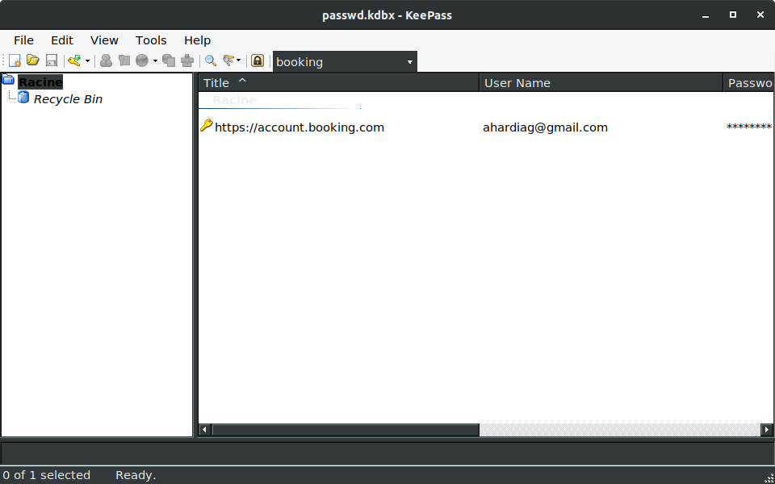
</div></<figcaption></figcaption></figure>

Double-click on the entry and override default sequence in the Auto-Type menu :

<figure align="center"><div style="text-align:center; width:400px;margin: 0 auto">

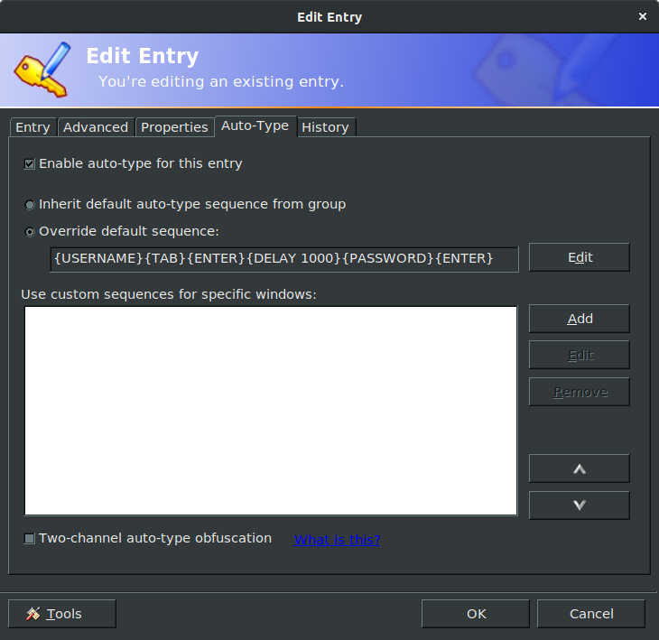
</div></<figcaption></figcaption></figure>

For instance, on booking.com website, one need to use the following procedure in order to manage the 2-steps login :
{USERNAME}{TAB}{ENTER}{DELAY 1000}{PASSWORD}{TAB}{TAB}{ENTER}

Once Keepass is opened, the shortcut `CTRL`+`ALT`+`A` should work as follows :
<figure align="center"><div style="text-align:center; width:400px;margin: 0 auto">


</div></<figcaption></figcaption></figure>

## KeepassXC (other method)
This is the linux friendly version of Keepass. It is more maintained than keepass, with more options and a nice documentation (https://keepassxc.org/docs/KeePassXC_UserGuide.html).

### Install
```Bash
sudo apt install keepassxc
```

### Autofill
You need to define a shortcut to use auto-type through Keepassxc
<figure align="center"><div style="text-align:center; width:400px;margin: 0 auto">

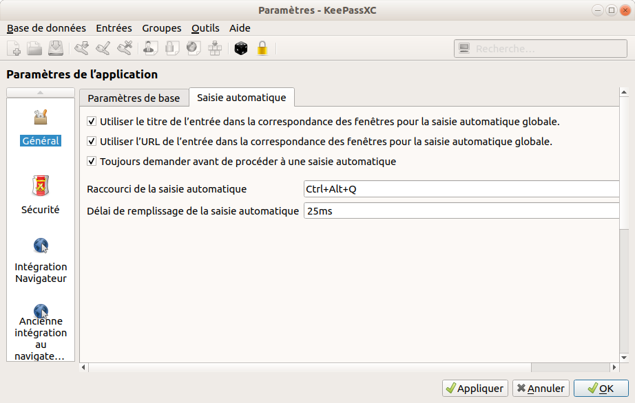
</div></<figcaption></figcaption></figure>

## Keepass on Android
Two solutions are quite famous :
- Keepass2android
- KeepassDX

Both can be found in the Play Store. Both allows to change keyboards with login and passwords available as key buttons.

I personnally like KeepassDX for its nice features ;
- biometric control
- the integrated keyboard which is clean
- the auto-fill functions

An example of use :

<figure align="center"><div style="text-align:center; width:300px;margin: 0 auto">


</div></<figcaption></figcaption></figure>

For more detailed tutorials,see :
- https://www.youtube.com/watch?v=DyDEIavz0X4

## Searching to an entry in a web browser on Android
When you want to do a quick search in your Keepass database on Android, like an URL, it is sometimes painful to do manually the search by switching the app. A nice feature is implemented in Keepass2android or KeepassDX : you can simply share the web page directly with the password manager, which allow to be quicker.

## Gdrive 
Synchronize Google Drive from a local folder (tested on Ubuntu 22.04):
https://doc.ubuntu-fr.org/google_drive


## NextCloud
Tested on Ubuntu 18.04, January 9th 2023:
Sources : https://doc.ubuntu-fr.org/nextcloud-client
### Install Nextcloud using apt and PPA sources
```Bash
sudo add-apt-repository ppa:nextcloud-devs/client
sudo apt install nextcloud-client nextcloud-client-nautilus
sudo apt install nextcloud-desktop
```
Open the nexcloud client, and use the following server to log in: `https://nextcloud.galaxy.ibpc.fr`
An authentification page will open in your default brower to finish the client installation.


<figure align="center"><div style="text-align:center; width:300px;margin: 0 auto">

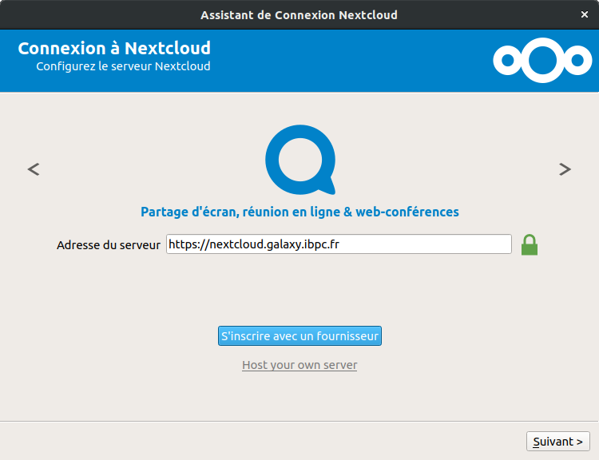
</div></<figcaption></figcaption></figure>

<figure align="center"><div style="text-align:center; width:300px;margin: 0 auto">

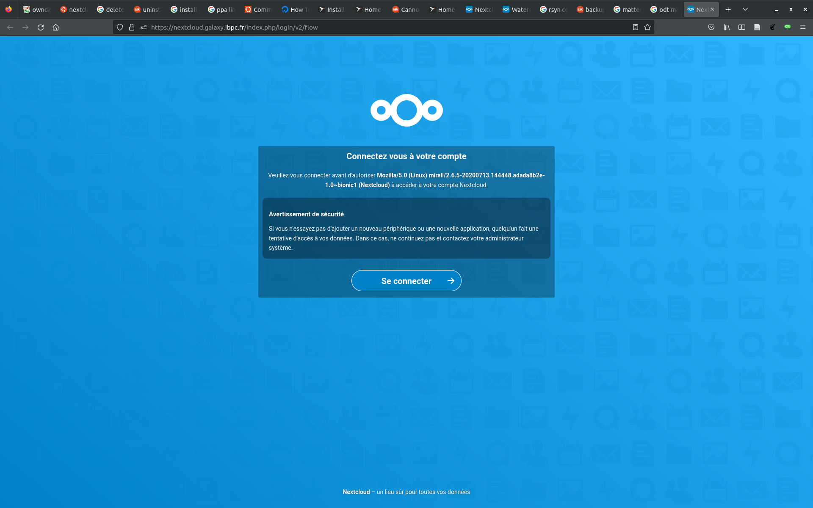
</div></<figcaption></figcaption></figure>

<figure align="center"><div style="text-align:center; width:300px;margin: 0 auto">

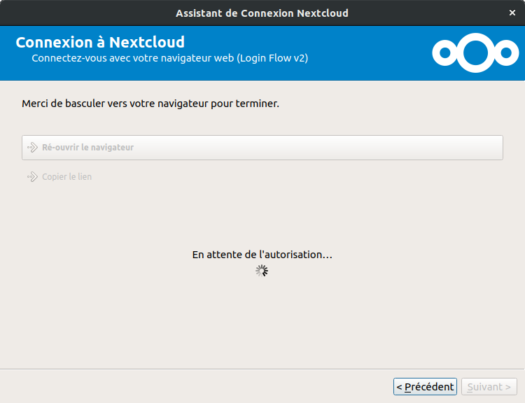
</div></<figcaption></figcaption></figure>

<figure align="center"><div style="text-align:center; width:300px;margin: 0 auto">

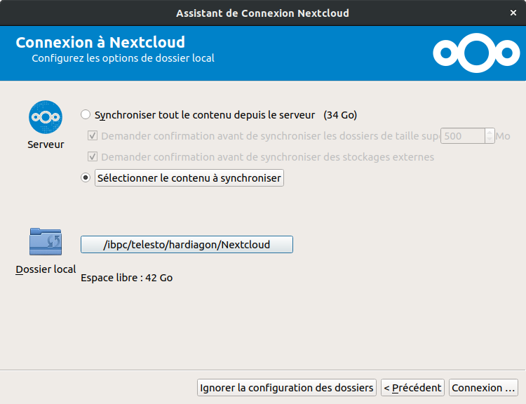
</div></<figcaption></figcaption></figure>

<figure align="center"><div style="text-align:center; width:300px;margin: 0 auto">

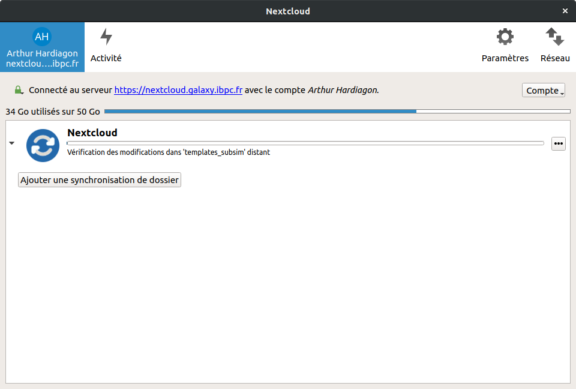
</div></<figcaption></figcaption></figure>


### Uninstall all nextcloud packages and dependencies
```Bash
sudo apt purge nextcloud-client nextcloud-client-nautilus nextcloud-desktop
sudo apt --purge autoremove nextcloud-client nextcloud-client-nautilus nextcloud-desktop
```

### Using snap
```Bash
sudo snap install nextcloud-desktop-client
```
It does not work properly in ibpc workstation. When launching nextcloud client, there is a issue with the home out of home directory.

## Latex 

### Latex distribution
```Bash
sudo apt install texlive-full -y # Heavy 5Go
sudo apt install texlive -y # Lighter 200 Mo
```

### Forward/backward previex
tex to pdf : `CTRL`+`ALT`+`J` 
pdf to tex : `CTLR`+`click left` 

### On VSCode
Need extension `LateX Workshop`
To build the current project : `CTRL`+ `L` `B` 

## Github

### Save a token (password key)
```Bash
git config --global credential.helper cache
```
It must be done after using a git command and given explicitly the token

### Deposit of a source code on HAL
How to ?
Slides:
https://hal.archives-ouvertes.fr/hal-01872189

Website version:
https://doc.archives-ouvertes.fr/deposer/deposer-le-code-source/

List of Licences :
https://spdx.org/licenses/

## Zotero

### Commands

#### Open the preview in Vscode
`CTRL K`+`V`

### Open Zotero with default GTK environment
**Command-line**
```bash
GTK_THEME=Default zotero
```
**Running Zotero by the App launcher** : add a line in ~/.locall/bin/zotero before calling `zotero-bin`
```bash
export GTK_THEME=Default
```

### Backup/Restore Zotero
https://aut.ac.nz.libguides.com/zotero/backup
sudo updatedb

### Repair sqlite
https://www.zotero.org/utils/dbfix/
- Do a backup of Zotero
- Close Zotero
- Upload .sqlite file
- Download the new .sqlite file and replace teh old one in the Zotero folder
- Restart Zotero

### Syncronize Zotero on a remote folder

- Open Zotero on your local machine
- In the menu Settings-> Advances, tick the box with personal folder and choose a remote folder.
e.g., you can use a remote folder previously mouted using sshfs, or a folder hosted on the lab server using Nextcloud

<figure align="center"><div style="text-align:center; width:400px;margin: 0 auto">

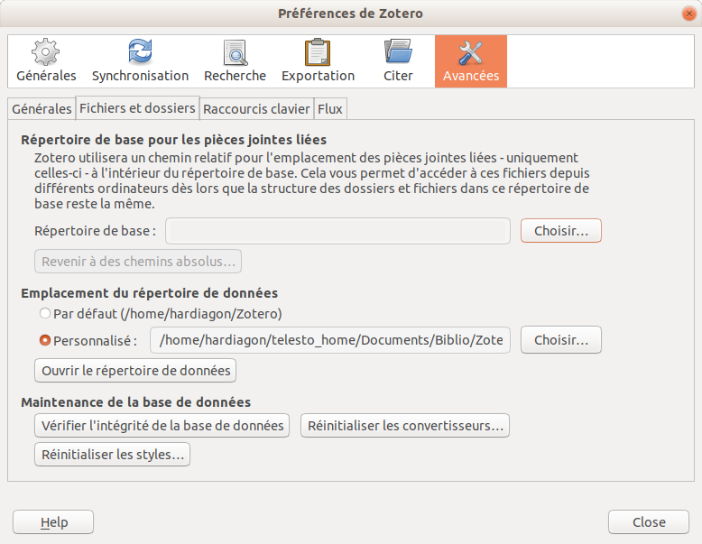
</div><figcaption>Synchronisation of Zotero on a remote folder.</figcaption></figure>

**Warning** : Pay attention on closing Zotero before opening Zotero on another machine, otherwise you may damage the sqlite database file.

## Google Drive on linux architecture

### Via Google-drive-ocamlfuse
https://doc.ubuntu-fr.org/google_drive#google-drive-ocamlfuse


## VSCode

### Useful extensions
- **Dataflex Colorize** : ??? do not know why it is installed
- **vscode-pdf** : visualize pdf
- **Spell Right** : orthographic corrector
    To link linux langages dictionaries to VSCODE :
    ```bash
    ln -s /usr/share/hunspell/* ~/.config/Code/Dictionaries
    ```
    remarks : Giving too many errors with latex compilation
- **LTex** : orthiographic corrector for markdown and latex files
To change the language, go to the settings of the extension
- **French Language Pack**
- **Jupyter**
- **Python** : to have better debug control on python code
- **vscode-pdf** (tomoki1207)


### Shortcuts
1) File -> Preferences -> Keyboard Shortcuts
2) Look for a specific command ,e.g. :
- shortcut to move from editor to terminal: `Focus Terminal`
my personal choice : `ALT`+ `T` 
- shortcut to move to first panel editor: `First Editor` 
my personal choice : `ALT`+ `E` 

#### Overview of principal keyboard shortcuts :
https://code.visualstudio.com/shortcuts/keyboard-shortcuts-linux.pdf

### Markdown

#### Preview markdown (on the right side)
After enaling a previewer like `Markdown Preview Enhanced` : 
`CTRL+K` `V`

#### Extensions :
- **Markdown Preview Enhanced**(YiYi Wang) : preview of markdown
- **Markdown PDF** : to convert in pdf format
- **Auto Markdown TOC** (Hunter Tran) : to create table of Contents
click right and update current TOC
- **Markdown Table** : to manipulate tables
- **Markdown Preview Github Styling** : to preview a md file as in Github readmes
- **Pandoc Citer** : to have autocompletion for bibliography

#### Link references in a markdown file
At the beggining of the document, write a yaml content :
```yaml
---
bibliography : path/to/bibliography.bib
---
```
When using @ symbol, we can now insert a reference from the bibliography found in the .bib file.

> :warning: the reference are formatted (e.g. Burner et al.(2019) only if we use pandoc as interpereter in `Markdown Preview Enhanced`. To activate it, go to `File->Preferences->Settings` search for keyword `pandoc`, and turn on the option `Markdown-preview-enhanced : Use Pandoc Parser`.

> :memo: use with the extension `Pandoc Citer` to have autocompletion of bibliography entries.

- **Markdown Include** : include .md file into another .md file

#### Image centered with caption :
```html
<figure align="center"><div style="text-align:center; width:300px;margin: 0 auto">


</div><figcaption>Figure 11 </figcaption></figure>
```

## Tcl-VMD toolbox

#### Render in png format with tachyon
```Tcl
render Tachyon myfigure  "/usr/local/lib/vmd/tachyon_LINUXAMD64" -aasamples 12 %s -format BMP -res 2400 2146 -o %s.bmp
convert myfigure.bmp myfigure.png
```

#### Render with tachyon and transparency and smaller size
```Tcl
render Tachyon myfigure  "/usr/local/lib/vmd/tachyon_LINUXAMD64" -aasamples 12 %s -format BMP -res 2400 2146 -o %s.bmp -trans_max_surfaces 1
convert myfigure.bmp -resize 50% myfigure.png
```

### Turorials
https://skblnw.github.io/mkvmd_render/
kv
#### Render a snapshot
```Tcl
set filename path_to_file
render snapshot $filename.tga
convert $filename.tga $filename.png -quality 10%
```

### Crop an image
```Bash
convert filename.bmp  -crop 1680x1600+380+290 filename.png
```

#### Operations on list 
```Tcl
vecaad
vecsub
vecinvers
```

#### Wrap a selection
```Tcl
pbc wrap -compound "residue"
```

#### draw a dashed line between two atoms and a measure distance
Menu `Mouse-> Lables->Bond(2)`
Or
` ALT`+`2`
Or `2` on the Numeric Pad
The second method allows to pass from one mouse menu to another (`ALT`+`1`, `ALT`+`2`,...)

## Inkscape
To add the lateral scroll : CTRL-B

## Network

### Get IP adress from domain name
```Bash
dig +short stackoverflow.com
```

### VPN

#### Method using nmcli commands

Method to add a VPN from .ovpn file using OpenVPN:

Télécharger le fichier personnalisé ovpn en suivant le lien du wiki et supprimer la ligne 7 (route remote_host 255.255.255.255 net_gateway) et renommer en username.ovnp puis en ligne de commande :
```Bash
sudo apt-get install network-manager-openvpn-gnome openvpn-systemd-resolved
sudo nmcli connection import type openvpn file <username.ovpn>
```
Après cette étape, tu peux déjà essayer de voir si tu as un icône VPN dans les paramètres Réseau, l'activer, et voir si tu arrives à ouvrir le wiki hébergé sur le réseau. Si la page s'affiche, ça marche !
Sinon, ça se peut que les adresses du réseau ne soient pas bien reconnus par ton FAI, du coup essaie cela également :
Commenter toutes les lignes dans /etc/hosts qui concernent IPv6 ($ sudo vim /etc/hosts) puis :
```Bash
sudo mv /etc/resolv.conf{,.orig}
sudo ln -s /run/systemd/resolve/resolv.conf /etc/resolv.conf
```
Puis ajouter manuellement les DNS de google sur la connection (filiaire ou wifi) sur le GUI NetworkManager Paramètre-> Réseau->roue dentée):

<figure align="center"><div style="text-align:center; width:500px;margin: 0 auto">

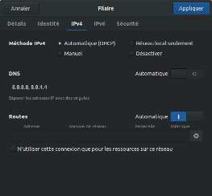
</div><figcaption>Figure 11 </figcaption></figure>


```Bash
sudo nmcli networking off
sudo nmcli networking on
```

Activer le VPN dans le GUI NetworkManager (sur gnome seulement), puis aller chercher le nom de la connexion à travers VPN, généralement tun0
```Bash
nmcli connection show
nmcli connection modify <nom de connexion> ipv4.never-default true
```
La tu peux essayer de nouveau de rentrer sur le wiki, ou pinger une adresse du réseau, par exemple:
```Bash
ping toto.lbt.ibpc.fr
```

Activate VPN once installed :
Activer le VPN dans le GUI NetworkManager (sur gnome seulement), puis aller chercher le nom de la connexion à travers VPN, généralement tun0
```Bash
nmcli connection show
nmcli connection modify <nom de connexion> ipv4.never-default true
```
Activer manuellement le VPN dans le menu en haut à droite, éventuellement en donnant le mot de passe 

<figure align="center"><div style="text-align:center; width:300px;margin: 0 auto">

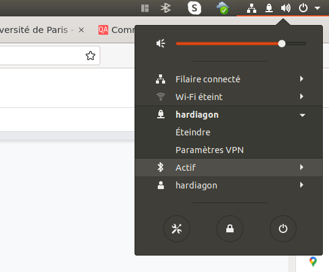
</div><figcaption>Figure 11 </figcaption></figure>

#### Use VPN on Debian 10 (machine sirius)
```Bash
# Activate VPN 
nmcli connection up hardiagon
# Disable IPV4 connections
vpn_id=$(nmcli connection show | grep tun0 | head -n 1 | awk '{print $2}')
nmcli connection modify $vpn_id  ipv4.never-default true
# Test both webserver and remote server
ping google.fr -w 3
ping toto.lbt.ibpc.fr -w 3
```

Rk : To do it automatically,  one can write this on a script called vpn which path is visible by the system.


#### GUI OpenVPN 

[Documentation Wiki IBPC](pdf/guide.vpn.ubuntu_16.10.pdf)

#### Install old version of OpenVPN in Ubuntu 22.04 in order to use old .ovpn files

https://askubuntu.com/questions/1404673/imported-openvpn-ovpn-profile-not-working-anymore-after-update-to-ubuntu-22-0/1406472#1406472

To prevent the uupdate to be automatic :
```Bash
sudo apt-mark hold openvpn
```
## Jupyter

### S’identifier en tant qu’administrateur
```Bash
jupyter notebook --allow-root
```

### Convert a notebook into a python script
Need module `jupyter_contrib_nbextensions` :
```Bash
jupyter nbconvert --to script notebook.ipynb
```

### Change conda environment
source : https://towardsdatascience.com/get-your-conda-environment-to-show-in-jupyter-notebooks-the-easy-way-17010b76e874

To avoid re-starting a jupyter server when we change conda environment, one can change kernels in the notebook menus.

1) Install `jupyterlab`,`notebook`,`ipykernel` in all conda environments you want to work in*
2) Install `jupyterlab`,`notebook` and `nb_conda_kernels` in your base environment
3) Launch `jupyter notebook` command from the `base` environment 
4) After opening a notebook, use `Kernel`>`Change kernel` and choose the conda environment

### Work remotely

#### Open a jupyter notebook from a remote server:

- Go to remote server and open the jupyter notebook in the working directory:
```Bash
jupyter notebook --no-browser --port 9999
```
Or to avoid closing the jupyter notebook if the terminal is close or connection stopped
```Bash
nohup jupyter notebook --no-browser --port 9999 & disown
```
- Open a tunnel SSH in local to be able to open the notebook in the local web browser:
```Bash
ssh -NL 9999:localhost:9999 <Host>
```
Remark : 
Host must be defined in .ssh/config
If the terminal is closed, the connection is lost, but thesame jupyter notebook can be reached by opening it the connection.

- Launch in a web browser bar address as `localhost:9999/`
A password is sometimes needed.

#### List jupyter notebooks servers open :
```Bash
jupyter notebook list
```

#### Delete a jupyter server :
```Bash
jupyter notebook stop 9999
```

#### Delete all jupyter servers and possible crashed servers :
```Bash
rm -i /home/hardiagon/.local/share/jupyter/runtime/*
```


<!--stackedit_data:
eyJoaXN0b3J5IjpbLTgwNjE4NTM0Ml19
-->


## Movie converter

#### Decrease size of a movie and convert formats

Show features of the movie :
```Bash
ffmpeg -i input.mpg 
```

Decrease size by changing video format:
```Bash
ffmpeg -i input.mp4 -vcodec libx265 -crf 28 output.mp4
```
The compression level is controlled by the `crf` value (between 24 to 30)
 https://unix.stackexchange.com/questions/28803/how-can-i-reduce-a-videos-size-with-ffmpeg

Reduce duration :
```Bash
ffmpeg -i movie_H01_pure_water_C770.mpg -ss 10 -fs  10000000    movie_H01_pure_water_C770.mp4
```
Change the quality :
```Bash
ffmpeg -i input.mp4 -vf scale=1280:720 output.mp4
```

Quality formats : 
1440p | 2 560:1 440.
1080p | 1 920:1 080.
720p  |  1 280:720.
480p  |    854:480.
360p  |    640:360.
240p  |    426:240.


Convert to gif :
```Bash
ffmpeg -i input.mpg -ss 00:00:05 -fs 5000000 -r 5  output.gif
```

`-ss` : time offset 
`-fs` : limit size for the file in bytes
`-r`  : frame rate for output (frames per second)


Simple Commands :
https://opensource.com/article/17/6/ffmpeg-convert-media-file-formats
https://www.winxdvd.com/resize-video/compress-video-with-ffmpeg.htm
Documentation : https://ffmpeg.org/ffmpeg.html#Audio-Options

### Convert images into a movie
```bash
ffmpeg -framerate 24 -pattern_type glob -i 'coral_single_images/coral_single_v*.png' -c:v libx264 -r 30 -pix_fmt yuv420p coral_single.mp4
```

## Vim

### Crypt a file (low level of encryption): 
```vim
:X
```
and enter the new passwords

### Compare files through ssh
```bashd
vimdiff /local:/path/file sftp://server//remote/path/file
```
One can use sftp or scp depending on the mode of communication.

Note: After the server name, one have to add another `/` and not `:` 


## AppImage
If we want to access easily to programs that can be runned by an AppImage, one can use `appimagelauncher`. Just follow this tutorial (in french) :https://ubunlog.com/fr/appimagelauncher-integra-appimges-en-ubuntu/

## CCDC : Cristallographic Database
To set up the CSD databse suite and Python API on linux, please follow the instructions found [here](./CCDC.md).

## Other linux commands

### Update search using the KDE research
```bash
sudo updatedb
```

### Open the current path with the file explorer
```bash
xdg-open . 
```

