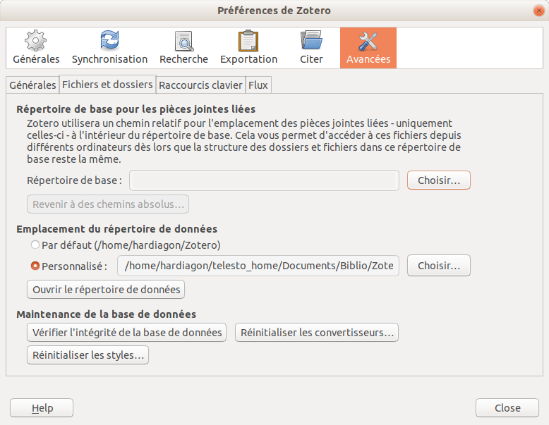
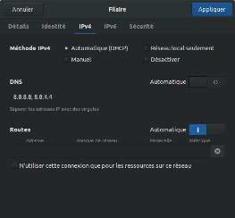
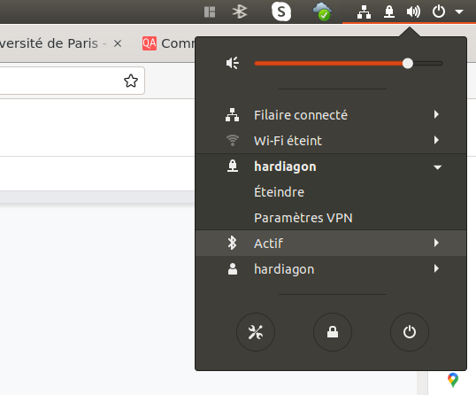

# General Software Toolbox for Linux

<!-- TOC -->

- [General Software Toolbox for Linux](#general-software-toolbox-for-linux)
    - [Gromacs](#gromacs)
            - [Compile Gromacs with X-Window gmx view, GPU CUDA support](#compile-gromacs-with-x-window-gmx-view-gpu-cuda-support)
        - [Change gromacs version in a fish shell](#change-gromacs-version-in-a-fish-shell)
        - [Use a handmade script ~/.local/bin/source_gmx to source files in different location in a fish shell](#use-a-handmade-script-localbinsource_gmx-to-source-files-in-different-location-in-a-fish-shell)
    - [Python Development](#python-development)
        - [Tests](#tests)
    - [Conda](#conda)
        - [Look for a package in all conda environments](#look-for-a-package-in-all-conda-environments)
    - [Pip](#pip)
        - [Install/Uninstall a package from source using setup.py and distutils](#installuninstall-a-package-from-source-using-setuppy-and-distutils)
    - [Keypass](#keypass)
        - [Download linux clients](#download-linux-clients)
            - [Convert firefox passwords to CSV](#convert-firefox-passwords-to-csv)
        - [Use auto-type to fill automatically fields when signing in from a web page](#use-auto-type-to-fill-automatically-fields-when-signing-in-from-a-web-page)
            - [Add urls in wab page titles](#add-urls-in-wab-page-titles)
    - [NextCloud](#nextcloud)
        - [Install Nextcloud using apt and PPA sources](#install-nextcloud-using-apt-and-ppa-sources)
        - [Uninstall all nextcloud packages and dependencies](#uninstall-all-nextcloud-packages-and-dependencies)
        - [Using snap](#using-snap)
    - [Latex](#latex)
        - [Latex distribution](#latex-distribution)
        - [Forward/backward previex](#forwardbackward-previex)
        - [On VSCode](#on-vscode)
    - [Github](#github)
        - [Save a token password key](#save-a-token-password-key)
        - [Deposit of a source code on HAL](#deposit-of-a-source-code-on-hal)
    - [Zotero](#zotero)
        - [Commands](#commands)
            - [Open the preview in Vscode](#open-the-preview-in-vscode)
        - [Open Zotero with default GTK environment](#open-zotero-with-default-gtk-environment)
        - [Backup/Restore Zotero](#backuprestore-zotero)
        - [Repair sqlite](#repair-sqlite)
        - [Syncronize Zotero on a remote folder](#syncronize-zotero-on-a-remote-folder)
    - [Google Drive on linux architecture](#google-drive-on-linux-architecture)
        - [Via Google-drive-ocamlfuse](#via-google-drive-ocamlfuse)
    - [VSCode](#vscode)
        - [Useful extensions](#useful-extensions)
        - [Shortcuts](#shortcuts)
            - [Overview of principal keyboard shortcuts :](#overview-of-principal-keyboard-shortcuts-)
        - [Markdown](#markdown)
            - [Preview markdown on the right side](#preview-markdown-on-the-right-side)
            - [Extensions :](#extensions-)
            - [Image centered with caption :](#image-centered-with-caption-)
    - [Tcl-VMD toolbox](#tcl-vmd-toolbox)
            - [Render in png format with tachyon](#render-in-png-format-with-tachyon)
            - [Render with tachyon and transparency and smaller size](#render-with-tachyon-and-transparency-and-smaller-size)
        - [Turorials](#turorials)
            - [Render a snapshot](#render-a-snapshot)
        - [Crop an image](#crop-an-image)
            - [Operations on list](#operations-on-list)
            - [Wrap a selection](#wrap-a-selection)
            - [draw a dashed line between two atoms and a measure distance](#draw-a-dashed-line-between-two-atoms-and-a-measure-distance)
    - [Inkscape](#inkscape)
    - [VPN](#vpn)
            - [Open a jupyter notebook from a remote server:](#open-a-jupyter-notebook-from-a-remote-server)
            - [List jupyter notebooks servers open :](#list-jupyter-notebooks-servers-open-)
            - [Delete a jupyter server :](#delete-a-jupyter-server-)
            - [Delete all jupyter servers and possible crashed servers :](#delete-all-jupyter-servers-and-possible-crashed-servers-)
            - [Use VPN on Debian 10 machine sirius](#use-vpn-on-debian-10-machine-sirius)
    - [Movie converter](#movie-converter)
            - [Decrease size of a movie and convert formats](#decrease-size-of-a-movie-and-convert-formats)
    - [Other linux commands](#other-linux-commands)
        - [Update search using the KDE research](#update-search-using-the-kde-research)
        - [Open the current path with the file explorer](#open-the-current-path-with-the-file-explorer)

<!-- /TOC -->

## Gromacs
#### Compile Gromacs with X-Window (`gmx view`), GPU CUDA support 
https://manual.gromacs.org/documentation/current/install-guide/index.html

```Bash
tar xfz gromacs-2022.3.tar.gz
cd gromacs-2022.3
mkdir build
cd build
cmake .. -DGMX_BUILD_OWN_FFTW=ON -DREGRESSIONTEST_DOWNLOAD=ON -DGMX_X11=on -DCMAKE_INSTALL_PREFIX=/opt/gromacs-2022/
make
make check
sudo make install
source /opt/gromacs/bin/GMXRC
```
### Change gromacs version in a fish shell
https://gist.github.com/pjohansson
```Bash
cd /path/to/gromacs
sudo wget "https://gist.githubusercontent.com/pjohansson/7a86da349161595bd4c1fa77c11be38e/raw/5e9b22b225e079e56284217c1f9dde87f4abc043/GMXRC.fish"
cd
source /path/to/gromacs/bin/GMXRC.fish
```

### Use a handmade script `~/.local/bin/source_gmx` to source files in different location (in a fish shell)

In a config file `~/source_gmxrc`, put all the paths where different gromacs version are installed as the following :
```Bash
# version_name path
2019.2 /path/to/gromacs-2019.2
...
```
Create a fish alias 
```Bash
alias source_gmx='bass source source_gmx'
funcsave source_gmx
```
Example of use : 
```Bash
source_gmx -f 2019.2
```

## Python Development

### Tests
https://py-pkgs.org/03-how-to-package-a-python#writing-tests

## Conda

### Look for a package in all conda environments
```Bash
conda search <package> --envs
```

## Pip

### Install/Uninstall a package from source using `setup.py` and `distutils`

Go to the subdirectory where the package directory is and :
```Bash
pip install ./directory_source
pip uninstall ./directory_source 
```

## Keypass
Allow to store passwords in an encryted database, than can be synchronized or use directly from a Web browser.

### Download linux clients
sudo apt install keepass2 keepassx xdotool

#### Convert firefox passwords to CSV
Download executable from https://github.com/kspearrin/ff-password-exporter and run it in command line, then export the passwords in a CSV file using columns : title, username, password.

### Use auto-type to fill automatically fields when signing in from a web page

Add a keyboard `CTRL`+`ALT`+`A` shortcut using the command :

```Bash
mono /usr/lib/keepass2/KeePass.exe --auto-type
```
When we use the shortcut from a web browser, it looks for the title of the page and try to match with the title entries of the keypass database. Since it is more convenient to convert URL than title, one can add in the html page the url n the title, as described above.

#### Add urls in web page titles
Download the extension for firefox : https://github.com/erichgoldman/add-url-to-window-title

## NextCloud
Tested on Ubuntu 18.04, January 9th 2023:
Sources : https://doc.ubuntu-fr.org/nextcloud-client
### Install Nextcloud using apt and PPA sources
```Bash
sudo add-apt-repository ppa:nextcloud-devs/client
sudo apt install nextcloud-client nextcloud-client-nautilus
sudo apt install nextcloud-desktop
```
Open the nexcloud client, and use the following server to log in: `https://nextcloud.galaxy.ibpc.fr`
An authentification page will open in your default brower to finish the client installation.


<figure align="center"><div style="text-align:center; width:300px;margin: 0 auto">


</div></<figcaption></figcaption></figure>

<figure align="center"><div style="text-align:center; width:300px;margin: 0 auto">


</div></<figcaption></figcaption></figure>

<figure align="center"><div style="text-align:center; width:300px;margin: 0 auto">


</div></<figcaption></figcaption></figure>

<figure align="center"><div style="text-align:center; width:300px;margin: 0 auto">


</div></<figcaption></figcaption></figure>

<figure align="center"><div style="text-align:center; width:300px;margin: 0 auto">


</div></<figcaption></figcaption></figure>


### Uninstall all nextcloud packages and dependencies
```Bash
sudo apt purge nextcloud-client nextcloud-client-nautilus nextcloud-desktop
sudo apt --purge autoremove nextcloud-client nextcloud-client-nautilus nextcloud-desktop
```

### Using snap
```Bash
sudo snap install nextcloud-desktop-client
```
It does not work properly in ibpc workstation. When launching nextcloud client, there is a issue with the home out of home directory.

## Latex 

### Latex distribution
```Bash
sudo apt install texlive-full -y # Heavy 5Go
sudo apt install texlive -y # Lighter 200 Mo
```

### Forward/backward previex
tex to pdf : `CTRL`+`ALT`+`J` 
pdf to tex : `CTLR`+`click left` 

### On VSCode
Need extension `LateX Workshop`
To build the current project : `CTRL`+ `L` `B` 

## Github

### Save a token (password key)
```Bash
git config --global credential.helper cache
```
It must be done after using a git command and given explicitly the token

### Deposit of a source code on HAL
How to ?
Slides:
https://hal.archives-ouvertes.fr/hal-01872189

Website version:
https://doc.archives-ouvertes.fr/deposer/deposer-le-code-source/

List of Licences :
https://spdx.org/licenses/

## Zotero

### Commands

#### Open the preview in Vscode
`CTRL K`+`V`

### Open Zotero with default GTK environment
**Command-line**
```bash
GTK_THEME=Default zotero
```
**Running Zotero by the App launcher** : add a line in ~/.locall/bin/zotero before calling `zotero-bin`
```bash
export GTK_THEME=Default
```

### Backup/Restore Zotero
https://aut.ac.nz.libguides.com/zotero/backup
sudo updatedb

### Repair sqlite
https://www.zotero.org/utils/dbfix/
- Do a backup of Zotero
- Close Zotero
- Upload .sqlite file
- Download the new .sqlite file and replace teh old one in the Zotero folder
- Restart Zotero

### Syncronize Zotero on a remote folder

- Open Zotero on your local machine
- In the menu Settings-> Advances, tick the box with personal folder and choose a remote folder.
e.g., you can use a remote folder previously mouted using sshfs, or a folder hosted on the lab server using Nextcloud

<figure align="center"><div style="text-align:center; width:400px;margin: 0 auto">


</div><figcaption>Synchronisation of Zotero on a remote folder.</figcaption></figure>

**Warning** : Pay attention on closing Zotero before opening Zotero on another machine, otherwise you may damage the sqlite database file.

## Google Drive on linux architecture

### Via Google-drive-ocamlfuse
https://doc.ubuntu-fr.org/google_drive#google-drive-ocamlfuse


## VSCode

### Useful extensions
- **Dataflex Colorize** : ??? do not know why it is installed
- **vscode-pdf** : visualize pdf
- **Spell Right** : orthographic corrector
    To link linux langages dictionaries to VSCODE :
    ```bash
    ln -s /usr/share/hunspell/* ~/.config/Code/Dictionaries
    ```
    remarks : Giving too many errors with latex compilation
- **LTex** : orthiographic corrector for markdown and latex files
To change the language, go to the settings of the extension


### Shortcuts
1) File -> Preferences -> Keyboard Shortcuts
2) Look for a specific command ,e.g. :
- shortcut to move from editor to terminal: `Focus Terminal`
my personal choice : `ALT`+ `T` 
- shortcut to move to first panel editor: `First Editor` 
my personal choice : `ALT`+ `E` 

#### Overview of principal keyboard shortcuts :
https://code.visualstudio.com/shortcuts/keyboard-shortcuts-linux.pdf

### Markdown

#### Preview markdown (on the right side)
After enaling a previewer like Markdown Preview Enhanced
`CTRL+K` `V`

#### Extensions :
- **Markdown Preview Enhanced** : preview of markdown
- **Markdown PDF** : to convert onin pdf format
- **Auto Markdown TOC** : to create table of Contents
- **Markdown Table** : to manipulate tables

#### Image centered with caption :
```html
<figure align="center"><div style="text-align:center; width:300px;margin: 0 auto">


</div><figcaption>Figure 11 </figcaption></figure>
```

## Tcl-VMD toolbox

#### Render in png format with tachyon
```Tcl
render Tachyon myfigure  "/usr/local/lib/vmd/tachyon_LINUXAMD64" -aasamples 12 %s -format BMP -res 2400 2146 -o %s.bmp
convert myfigure.bmp myfigure.png
```

#### Render with tachyon and transparency and smaller size
```Tcl
render Tachyon myfigure  "/usr/local/lib/vmd/tachyon_LINUXAMD64" -aasamples 12 %s -format BMP -res 2400 2146 -o %s.bmp -trans_max_surfaces 1
convert myfigure.bmp -resize 50% myfigure.png
```

### Turorials
https://skblnw.github.io/mkvmd_render/
kv
#### Render a snapshot
```Tcl
set filename path_to_file
render snapshot $filename.tga
convert $filename.tga $filename.png -quality 10%
```

### Crop an image
```Bash
convert filename.bmp  -crop 1680x1600+380+290 filename.png
```

#### Operations on list 
```Tcl
vecaad
vecsub
vecinvers
```

#### Wrap a selection
```Tcl
pbc wrap -compound "residue"
```

#### draw a dashed line between two atoms and a measure distance
Menu `Mouse-> Lables->Bond(2)`
Or
` ALT`+`2`
Or `2` on the Numeric Pad
The second method allows to pass from one mouse menu to another (`ALT`+`1`, `ALT`+`2`,...)

## Inkscape
To add the lateral scroll : CTRL-B


## VPN
Method to add a VPN from .ovpn file using OpenVPN:

Télécharger le fichier personnalisé ovpn en suivant le lien du wiki et supprimer la ligne 7 (route remote_host 255.255.255.255 net_gateway) et renommer en username.ovnp puis en ligne de commande :
```Bash
sudo apt-get install network-manager-openvpn-gnome openvpn-systemd-resolved
sudo nmcli connection import type openvpn file <username.ovpn>
```
Après cette étape, tu peux déjà essayer de voir si tu as un icône VPN dans les paramètres Réseau, l'activer, et voir si tu arrives à ouvrir le wiki hébergé sur le réseau. Si la page s'affiche, ça marche !
Sinon, ça se peut que les adresses du réseau ne soient pas bien reconnus par ton FAI, du coup essaie cela également :
Commenter toutes les lignes dans /etc/hosts qui concernent IPv6 ($ sudo vim /etc/hosts) puis :
```Bash
sudo mv /etc/resolv.conf{,.orig}
sudo ln -s /run/systemd/resolve/resolv.conf /etc/resolv.conf
```
Puis ajouter manuellement les DNS de google sur la connection (filiaire ou wifi) sur le GUI NetworkManager Paramètre-> Réseau->roue dentée):

<figure align="center"><div style="text-align:center; width:500px;margin: 0 auto">


</div><figcaption>Figure 11 </figcaption></figure>


```Bash
sudo nmcli networking off
sudo nmcli networking on
```

Activer le VPN dans le GUI NetworkManager (sur gnome seulement), puis aller chercher le nom de la connexion à travers VPN, généralement tun0
```Bash
nmcli connection show
nmcli connection modify <nom de connexion> ipv4.never-default true
```
La tu peux essayer de nouveau de rentrer sur le wiki, ou pinger une adresse du réseau, par exemple:
```Bash
ping toto.lbt.ibpc.fr
```

Activate VPN once installed :
Activer le VPN dans le GUI NetworkManager (sur gnome seulement), puis aller chercher le nom de la connexion à travers VPN, généralement tun0
```Bash
nmcli connection show
nmcli connection modify <nom de connexion> ipv4.never-default true
```
Activer manuellement le VPN dans le menu en haut à droite, éventuellement en donnant le mot de passe 

<figure align="center"><div style="text-align:center; width:300px;margin: 0 auto">


</div><figcaption>Figure 11 </figcaption></figure>


#### Open a jupyter notebook from a remote server:

- Go to remote server and open the jupyter notebook in the working directory:
```Bash
jupyter notebook --no-browser --port 9999
```
Or to avoid closing the jupyter notebook if the terminal is close or connection stopped
```Bash
nohup jupyter notebook --no-browser --port 9999 & disown
```
- Open a tunnel SSH in local to be able to open the notebook in the local web browser:
```Bash
ssh -NL 9999:localhost:9999 <Host>
```
Remark : 
Host must be defined in .ssh/config
If the terminal is closed, the connection is lost, but thesame jupyter notebook can be reached by opening it the connection.

- Lauch in a we browser by typing localhost:9999/
A password is sometimes needed

#### List jupyter notebooks servers open :
```Bash
jupyter notebook list
```

#### Delete a jupyter server :
```Bash
jupyter notebook stop 9999
```

#### Delete all jupyter servers and possible crashed servers :
```Bash
rm -i /home/hardiagon/.local/share/jupyter/runtime/*
```

#### Use VPN on Debian 10 (machine sirius)
```Bash
# Activate VPN 
nmcli connection up hardiagon
# Disable IPV4 connections
vpn_id=$(nmcli connection show | grep tun0 | head -n 1 | awk '{print $2}')
nmcli connection modify $vpn_id  ipv4.never-default true
# Test both webserver and remote server
ping google.fr -w 3
ping toto.lbt.ibpc.fr -w 3
```

Rk : To do it automatically,  one can write this on a script called vpn which path is visible by the system.


<!--stackedit_data:
eyJoaXN0b3J5IjpbLTgwNjE4NTM0Ml19
-->


## Movie converter

#### Decrease size of a movie and convert formats

Show features of the movie :
```Bash
ffmpeg -i input.mpg 
```

Decrease size by changing video format:
```Bash
ffmpeg -i input.mp4 -vcodec libx265 -crf 28 output.mp4
```
The compression level is controlled by the `crf` value (between 24 to 30)
 https://unix.stackexchange.com/questions/28803/how-can-i-reduce-a-videos-size-with-ffmpeg

Reduce duration :
```Bash
ffmpeg -i movie_H01_pure_water_C770.mpg -ss 10 -fs  10000000    movie_H01_pure_water_C770.mp4
```
Change the quality :
```Bash
ffmpeg -i input.mp4 -vf scale=1280:720 output.mp4
```

Quality formats : 
1440p | 2 560:1 440.
1080p | 1 920:1 080.
720p  |  1 280:720.
480p  |    854:480.
360p  |    640:360.
240p  |    426:240.


Convert to gif :
```Bash
ffmpeg -i input.mpg -ss 00:00:05 -fs 5000000 -r 5  output.gif
```

`-ss` : time offset 
`-fs` : limit size for the file in bytes
`-r`  : frame rate for output (frames per second)


Simple Commands :
https://opensource.com/article/17/6/ffmpeg-convert-media-file-formats
https://www.winxdvd.com/resize-video/compress-video-with-ffmpeg.htm
Documentation : https://ffmpeg.org/ffmpeg.html#Audio-Options

## Other linux commands

### Update search using the KDE research
```bash
sudo updatedb
```

### Open the current path with the file explorer
```bash
xdg-open . 
```

