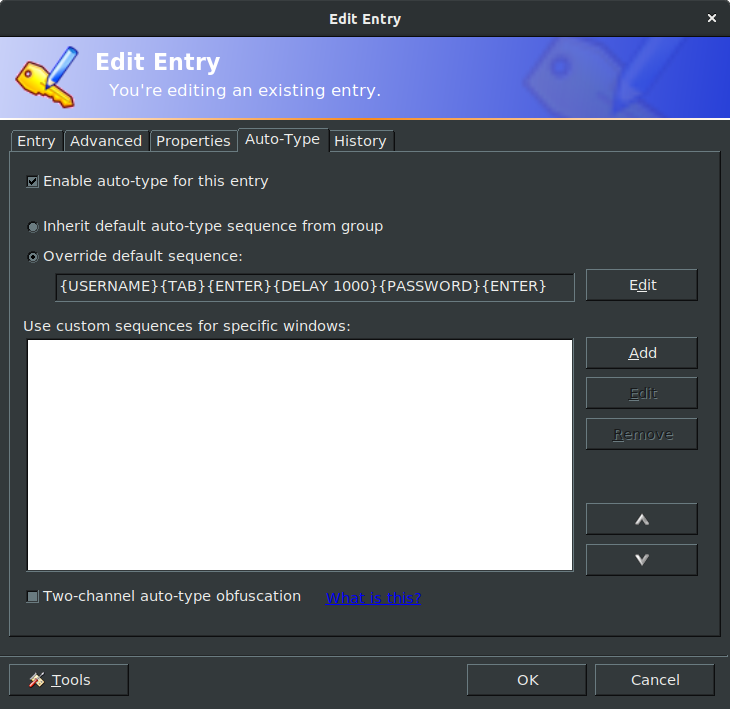

## Keepass 
<p><sub>(Tested on Linux 18.04)</sub></p>

Store and manage passwords in an encryted database for a safer use.
The database can be synchronized in a server (Nextcloud, Dropbox, ...) and can be accessed through a unique master password in all your devices (PC, Mac, Android). A keyboard shortcut allows to fill automatically the fields required to log in a web page.
This is a good secure solution against bad practices like saving passwords in a browser. Once setting up the method, do not forget to unset the feature "Remember Password" in the settings of your web browser !

### Download linux client
```Bash
sudo apt install keepass2 xdotool
```

### Get passwords saved in a web browser

There is several ways to save the passwords in CSV file, depending on the web browser you use.

On Google Chrome : 
In the URL bar, search for setting `chrome://settings/passwords` and click on "export passwords". It will save a CSV file that one can modify afterwards. This CSV file can be imported in a password manager like Keepass (`database`$\rightarrow$`import`$\rightarrow$`import csv file`).

**BE CAREFUL TO DELETE COMPLETELY THE CSV FILE AFTER USING IT !**

On firefox using a CLI program : https://github.com/kspearrin/ff-password-exporter

Note that it is very easy for anyone having access to your session to get all your saved passwords in browsers in a few seconds!


### Use auto-type to fill automatically fields to log in

Add a keyboard `CTRL`+`ALT`+`A` shortcut using the command :

```Bash
mono /usr/lib/keepass2/KeePass.exe --auto-type
```
When we use the shortcut from a web browser, it looks for the title of the page and try to match with the title entries of the keepass database. Since it is more convenient to convert URL than title, one can add in the html page the url in the title, as described above.

### Add urls in web page titles

Download the extension for firefox : https://github.com/erichgoldman/add-url-to-window-title

If you use another browser, look for an equivalent extension to do the job.

### Auto-typing format
Sometimes, we need to log in two steps and the default auto-typing format {USERNAME}{TAB}{PASSWORD}{ENTER} fails. You have to define the auto-typing format for the entry.

In Keepass, search for the entry :

<figure align="center"><div style="text-align:center; width:400px;margin: 0 auto">


</div></<figcaption></figcaption></figure>

Double-click on the entry and override default sequence in the Auto-Type menu :

<figure align="center"><div style="text-align:center; width:400px;margin: 0 auto">


</div></<figcaption></figcaption></figure>

For instance, on booking.com website, one need to use the following procedure in order to manage the 2-steps login :
{USERNAME}{TAB}{ENTER}{DELAY 1000}{PASSWORD}{TAB}{TAB}{ENTER}

Once Keepass is opened, the shortcut `CTRL`+`ALT`+`A` should work as follows :
<figure align="center"><div style="text-align:center; width:400px;margin: 0 auto">


</div></<figcaption></figcaption></figure>

## KeepassXC (other method)
This is the linux friendly version of Keepass. Developers are more active. There are more options and a nice documentation (https://keepassxc.org/docs/KeePassXC_UserGuide.html).

### Install
```Bash
sudo apt install keepassxc
```

### Autofill
You need to define a shortcut directly in Keepassxc to use the auto-typing feature in browsers.
<figure align="center"><div style="text-align:center; width:400px;margin: 0 auto">


</div></<figcaption></figcaption></figure>

## Keepass on Android
Two solutions are quite famous :
- Keepass2android
- KeepassDX

Both apps can be found in the Play Store and allow to switch to a specific keyboards with key buttons for login and passwords.

Note that KeepassDX have some nice features like :
- the biometric control
- a imple integrated keyboard
- the auto-fill functions

An example of use :

<figure align="center"><div style="text-align:center; width:300px;margin: 0 auto">


</div></<figcaption></figcaption></figure>

For more detailed tutorials,see :
- https://www.youtube.com/watch?v=DyDEIavz0X4

### Automatic search for an entry inside a web browser on Android
When you want to do a quick search in your Keepass database on Android, like an URL, you might not find it convenient since you have to switch manually between your browser and your password manager. Looking for an url located in Keepass2android or KeepassDX : you can simply share the web page directly with the password manager. It implies that the `title` entries in your database are log-in urls.